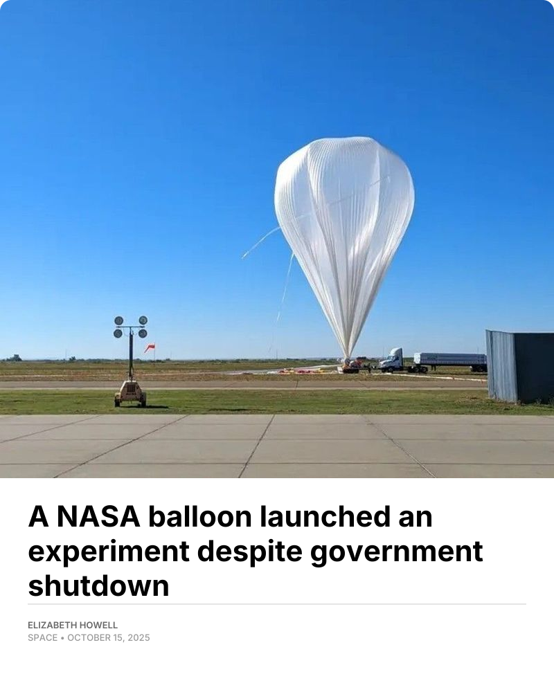

# News Snippet Generator

Generate shareable image snippets from news article links.

## What it does
- Takes a news article URL  
- Extracts metadata  
- Produces a clean, styled snippet image

## Example
A generated snippet image:



## Tech stack
- Next.js  
- TypeScript

## Getting started
```bash
git clone https://github.com/divij-pawar/news-snippet-gen.git
cd news-snippet-gen
npm install
npm run dev
```

Open `http://localhost:3000`.
